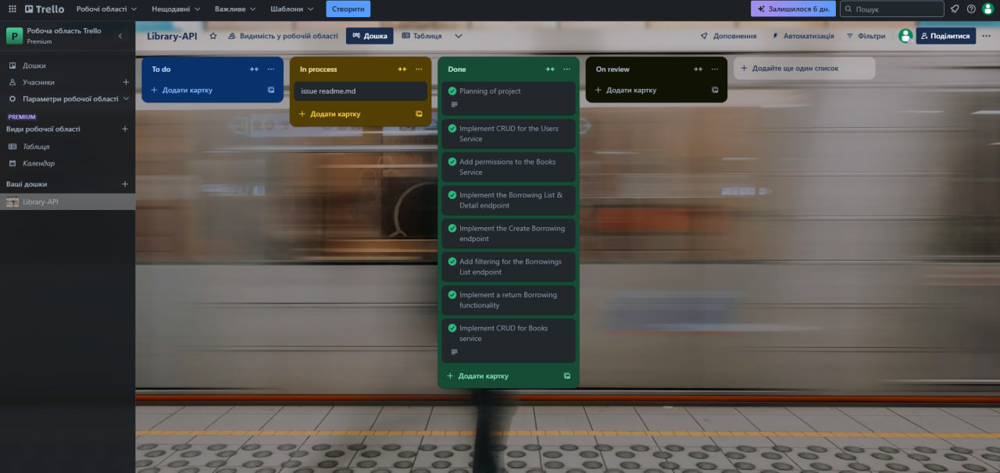
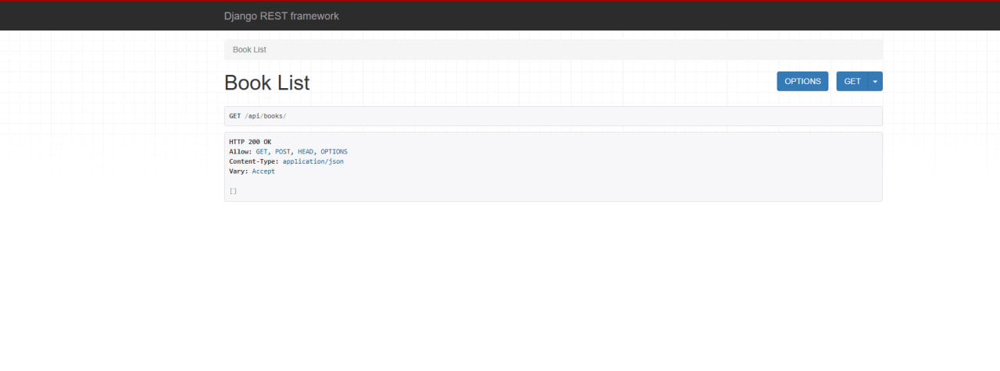
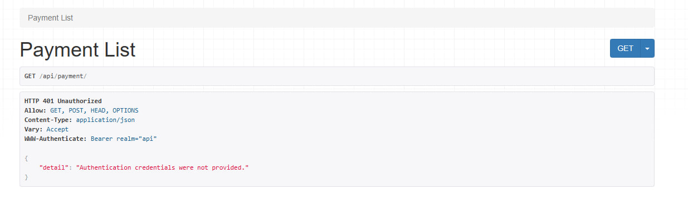
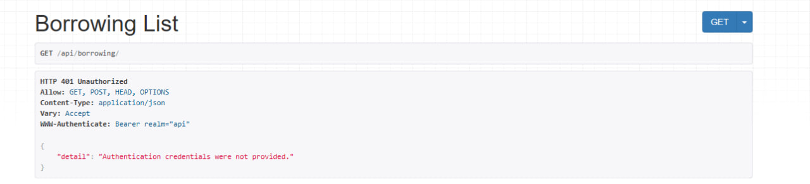
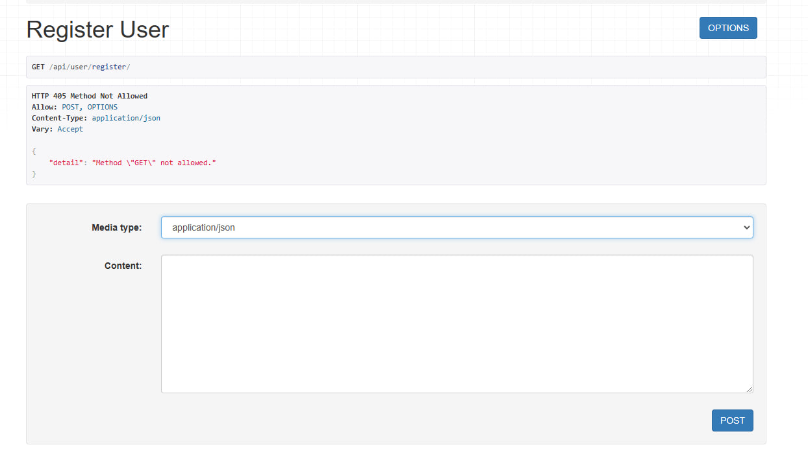

# Library Service

## Description
Library-API is a RESTful API designed to manage book loans in a library system. It allows users to browse available books, borrow and return them, and track loan statuses. The system supports authentication, user roles (e.g., admin, member), and book availability management. Built with Django and DRF, Library-API ensures efficient and secure book lending operations.

## Technologies Used
- Python
- Django ORM
- Django
- DRF
- Docker

## Features
- API with Books data
- Borrowing feature
- Filtering Borrowings list

## Setup
To install the project locally, follow these steps:

```sh
git clone https://github.com/Postpostman/Library-API.git
cd Library-API
python -m venv venv
```

Activate the virtual environment:

```sh
# On Windows:
venv\Scripts\activate

# On macOS/Linux:
source venv/bin/activate
```

Install dependencies:

```sh
pip install -r requirements.txt
```

### .env file
Create a `.env` file and add the required environment variables as shown in `sample.env`.

## Commands to Test the Project
Run tests and check code style using flake8:

```sh
python manage.py test
flake8
```

## Access
To create a superuser, use:

```sh
python manage.py createsuperuser
```

After creating the superuser, log in at `/users/token/` to obtain your authentication token for authorized access to the Library API.

To start the server:

```sh
python manage.py runserver
```

## Docker
You can also run the service using Docker:

### Build the Docker image:
```sh
docker build -t Library-API .
```

### Run the container and server:
```sh
docker run -p 8000:8000 Library-API
```

## API Endpoints

### Documentation
- **GET** `/docs/` - Access Swagger UI documentation
- **GET** `/download_docs/` - Download the API schema

### Books Service
- **POST** `/books/` - Add a new book
- **GET** `/books/` - Retrieve a list of books
- **GET** `/books/<id>/` - Retrieve book details
- **PUT/PATCH** `/books/<id>/` - Update book (also manage inventory)
- **DELETE** `/books/<id>/` - Delete book

### Users Service
- **POST** `/users/register/` - Register a new user
- **POST** `/users/token/` - Get JWT tokens
- **POST** `/users/token/refresh/` - Refresh JWT token
- **GET** `/users/me/` - Retrieve user profile
- **PUT/PATCH** `/users/me/` - Update profile

### Borrowing Service
- **POST** `/borrowing/` - Create a new borrowing entry (reduces inventory by 1)
- **GET** `/borrowing/?user_id=...&is_active=...` - Filter borrowings by user ID and active status
- **GET** `/borrowing/<id>/` - Retrieve details of a specific borrowing
- **POST** `/borrowing/<id>/return/` - Mark a book as returned (increases inventory by 1)

## Screenshots
Trello tasks

Book list

Payment list

Borrowing list

Register api

